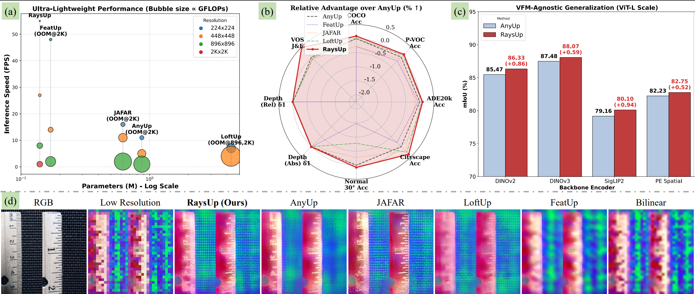

<p align="center">
  <h1 align="center">
    RaysUp: Ultra-light Universal Feature Upsampling via Geometry-Aware Ray Representation
    <br>
    [ECCV 2026]
  </h1>
  <p align="center">
  <a href="https://github.com/dyccyber"><strong>Yuchuan Ding*</strong></a>
  -
  <a href="https://lif314.github.io/"><strong>Linfei Li*</strong></a>
  -
  <a href="https://scholar.google.com/citations?user=8VOk_S4AAAAJ&hl=en"><strong>Lin Zhang</strong></a>
  -
  <a href="https://scholar.google.com/citations?user=A0N_mS0AAAAJ&hl=en"><strong>Ying Shen</strong></a>
</p>
<p align="center" style="font-size:14px;">
  <em>* Equal contributions (Co-first authors). Corresponding author: Lin Zhang.</em>
</p>

  <h3 align="center"><a href="https://lif314.github.io/projects/raysup/">Project page</a> 
| <a href="https://arxiv.org/abs/2606.22749">Paper(CVF)</a> | <a href="https://arxiv.org/abs/2606.22749">Paper(arXiv)</a>
  </h3>
  <div align="center"></div>
</p>

<p align="left">
  <a href="">
    
  </a>
</p>

## News & Updates

- [ ] Release trained checkpoints.
- [ ] Complete code test.
- [x] Code cleaned & released.

<details open="open" style="padding: 10px; border-radius:5px 30px 30px 5px; border-style: solid; border-width: 1px;">
  <summary>Table of Contents</summary>
  <ol>
    <li><a href="#news--updates">News & Updates</a></li>
    <li><a href="#installation">Installation</a></li>
    <li><a href="#configuration">Configuration</a></li>
    <li><a href="#dataset-download">Dataset Download</a></li>
    <li><a href="#train-raysup">Train RaysUp</a></li>
    <li><a href="#semantic-segmentation-evaluation">Semantic Segmentation Evaluation</a></li>
    <li><a href="#video-segmentation-evaluation">Video Segmentation Evaluation</a></li>
    <li><a href="#baseline-or-ablation-loading">Baseline Or Ablation Loading</a></li>
    <li><a href="#acknowledgement">Acknowledgement</a></li>
    <li><a href="#citation">Citation</a></li>
  </ol>
</details>

## Installation

We use conda and uv together by default. A pure conda or pure uv setup should also work.

CUDA only needs to match the installed PyTorch build. We have tested multiple CUDA settings from 11.8 to 12.8.

Example environment:

```bash
conda create -n raysup python=3.12 -y
conda activate raysup
pip install uv

uv pip install torch==2.9.0 torchvision==0.24.0 --index-url https://download.pytorch.org/whl/cu128
uv pip install einops matplotlib numpy timm plotly tensorboard hydra-core rich scikit-learn
```

Install NATTEN after PyTorch. Choose the NATTEN build that matches your PyTorch and CUDA versions from the [NATTEN releases](https://github.com/SHI-Labs/NATTEN/releases).


## Configuration

Dataset roots, checkpoints, output directories, and evaluation settings are configured in `config/` or through Hydra command-line overrides.

Backbone names can be checked in `src/backbone/vit_wrapper.py`. Set the backbone with:

```bash
backbone.name=vit_small_patch14_dinov2.lvd142m
```

## Dataset Download

Dataset download helpers are provided in `scripts/download_datasets.sh`.

```bash
DATA_ROOT=/path/to/seg bash scripts/download_datasets.sh coco voc ade20k davis
```

Available dataset names:

```bash
coco
cityscapes
voc
ade20k
davis
all
```

Cityscapes requires an account:

```bash
CITYSCAPES_USERNAME=<username> \
CITYSCAPES_PASSWORD=<password> \
DATA_ROOT=/path/to/seg \
bash scripts/download_datasets.sh cityscapes
```

After downloading, set dataset roots in `config/dataset_evaluation/`. The generated default locations are:

```text
COCOStuff:  ${DATA_ROOT}/COCOStuff
Cityscapes: ${DATA_ROOT}/cityscapes
VOC:        ${DATA_ROOT}/VOC
ADE20K:     ${DATA_ROOT}/ADEChallengeData2016
DAVIS:      ${DATA_ROOT}/DAVIS
```

## Train RaysUp

Recommended fast training entry, using fake camera poses:

```bash
python train_rays_fakepose.py \
  backbone.name=vit_small_patch14_dinov2.lvd142m \
  max_steps=100000 \
  epochs=1 \
  hydra.run.dir=output/raysup/dinov2
```

Training entry using DA3 pose estimation:

```bash
python train_rays.py \
  backbone.name=vit_small_patch14_dinov2.lvd142m \
  da3.size=large \
  max_steps=100000 \
  epochs=1 \
  hydra.run.dir=output/raysup/dinov2
```

DA3 can be switched from the command line:

```bash
da3.size=small
da3.size=base
da3.size=large
da3.name=<custom-da3-model-name-or-path>
```

Checkpoints are saved under the Hydra output directory.

## Semantic Segmentation Evaluation

Entry file:

```text
evaluation/train_probes.py
```

VOC semantic segmentation:

```bash
python evaluation/train_probes.py \
  eval.task=seg \
  dataset_evaluation=voc \
  backbone.name=vit_small_patch14_dinov2.lvd142m \
  eval.upsampler_name=raysup \
  eval.model_ckpt=<checkpoint> \
  hydra.run.dir=evaluation/unsupervised/voc/vit_small_patch14_dinov2.lvd142m
```

Other semantic segmentation datasets use the same entry and replace `dataset_evaluation`:

```bash
dataset_evaluation=coco
dataset_evaluation=cityscapes
dataset_evaluation=ade20k
```

Dataset roots are configured in `config/dataset_evaluation/`.

## Video Segmentation Evaluation

Entry file:

```text
evaluation/eval_video_seg.py
```

DAVIS video segmentation:

```bash
python evaluation/eval_video_seg.py \
  dataset_evaluation=davis \
  backbone.name=vit_small_patch14_dinov2.lvd142m \
  eval.upsampler_name=raysup \
  eval.model_ckpt=<checkpoint> \
  eval.ups_factor=2 \
  hydra.run.dir=evaluation/unsupervised/davis/vit_small_patch14_dinov2.lvd142m
```

Outputs are written inside the Hydra run directory. DAVIS metrics are saved as CSV files and `davis_metrics.json`.

## Baseline Or Ablation Loading

The evaluation loaders share the same model-loading interface.

Bilinear upsampling:

```bash
eval.upsampler_name=bilinear eval.model_ckpt=null
```

External local torch.hub baselines:

```bash
eval.upsampler_name=featup eval.external_repo_path=<LOCAL_FEATUP_REPO>
eval.upsampler_name=anyup eval.external_repo_path=<LOCAL_ANYUP_REPO>
eval.upsampler_name=loftup eval.external_repo_path=<LOCAL_LOFTUP_REPO>
```

RaysUp:

```bash
eval.upsampler_name=raysup eval.model_ckpt=<checkpoint>
```

## Acknowledgement

We thank the authors of the following repositories for their open-source code:

- [FeatUp](https://github.com/mhamilton723/FeatUp)
- [AnyUp](https://github.com/wimmerth/anyup)
- [Depth Anything 3](https://github.com/DepthAnything/Depth-Anything-3)
- [NATTEN](https://github.com/SHI-Labs/NATTEN)
- [JAFAR](https://github.com/PaulCouairon/JAFAR)
- [NAF](https://github.com/valeoai/NAF)

## Citation

If you find our paper and code useful for your research, please use the following BibTeX entry.

```bibtex
@inproceedings{raysup_eccv2026,
  title={RaysUp: Ultra-light Universal Feature Upsampling via Geometry-Aware Ray Representation},
  author={Ding, Yuchuan and Li, Linfei and Zhang, Lin and Shen, Ying},
  booktitle={ECCV},
  year={2026}
}
```
