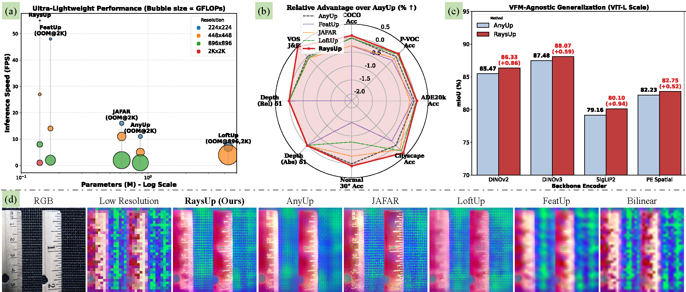

<p align="center">
  <h1 align="center">
    RaysUp: Ultra-light Universal Feature Upsampling via Geometry-Aware Ray Representation
    <br>
    [ECCV 2026]
  </h1>
  <p align="center">
  <a href="https://github.com/dyccyber"><strong>Yuchuan Ding*</strong></a>
  ·
  <a href="https://lif314.github.io/"><strong>Linfei Li*</strong></a>
  ·
  <a href="https://scholar.google.com/citations?user=8VOk_S4AAAAJ&hl=en"><strong>Lin Zhang†</strong></a>
  ·
  <a href="https://scholar.google.com/citations?user=A0N_mS0AAAAJ&hl=en"><strong>Ying Shen</strong></a>
</p>
<p align="center" style="font-size:14px;">
  <em>* Equal contributions (Co-first authors). &nbsp;&nbsp; † Corresponding author.</em>
</p>

  <h3 align="center"><a href="https://lif314.github.io/projects/raysup/">🌐Project page</a> 
| <a href="">📝Paper(CVF)</a> | <a href="">📝Paper(arXiv)</a>
  </h3>
  <div align="center"></div>
</p>

<p align="left">
  <a href="">
    
  </a>
</p>

<!-- TABLE OF CONTENTS -->
<details open="open" style='padding: 10px; border-radius:5px 30px 30px 5px; border-style: solid; border-width: 1px;'>
  <summary>Table of Contents</summary>
  <ol>
    <li>
      <a href="#installation">Installation</a>
    </li>
    <li>
      <a href="#acknowledgement">Acknowledgement</a>
    </li>
    <li>
      <a href="#citation">Citation</a>
    </li>
  </ol>
</details>

## Installation


## Acknowledgement
We thank the authors of the following repositories for their open-source code:


## Citation

If you find our paper and code useful for your research, please use the following BibTeX entry.

```bibtex
@inproceedings{raysup_eccv2026,
  title={RaysUp: Ultra-light Universal Feature Upsampling via Geometry-Aware Ray Representation},
  author={Ding, Yuchuan and Li, Linfei and Zhang, Lin and Shen, Ying},
  booktitle={ECCV},
  year={2026}
}
```
